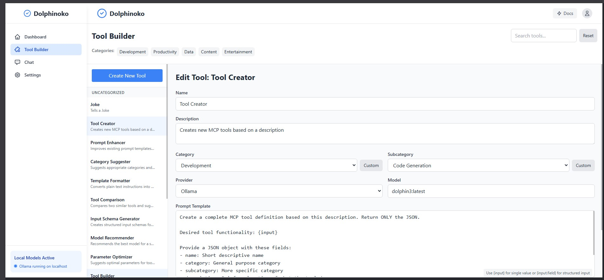

# 🐬 Dolphinoko

My take on a user-friendly UI for building and using LLM-powered tools via the Dolphin Model Context Protocol (MCP) developed by [Eric Hartford](https://github.com/cognitivecomputations/dolphin-mcp) and Cognitive Computations. The toolbox is designed to be a simple, intuitive way to create and manage AI tools powered by local models, with optional integration with cloud models like Claude. The UI is inspired by classic software design, with a clean, retro aesthetic that harkens back to the days of Windows 95 and early 2000s software because I'm about damn tired of SaSS. The backend is built with FastAPI and the frontend with React/TypeScript, with a focus on clean, modular code and a clear separation between the two for some of us that think a little crazier.


## 🚀 Features

- 🛠️ Create and manage AI tools powered by local models
- 🏠 Run everything locally with Ollama
- ☁️ Optional integration with cloud models like Claude
- 📱 Clean, intuitive UI inspired by classic software design
- 🔧 Use MCP protocol for flexible model interaction

## 📋 Prerequisites

- [Python](https://www.python.org/) 3.8 or higher
- [Node.js](https://nodejs.org/) 16.x or higher
- [Ollama](https://ollama.ai/) for local model inference
- [dolphin-mcp](https://github.com/cognitivecomputations/dolphin-mcp) (installed automatically)

## !! NOTICE:
Literally following the advice to "Just ship it." This is AS IS, but shouldn't break anything by itself. NO responsibility for any damage, loss, or anything else. Use at your own risk. I'm scared myself. :D

Lots of bugs and issues, but I'm working on it. If you want to help, please do! Primary next steps will be:
- Anthropic integration finish
- Dark mode because my eyes just can't anymore (and styling in general)
- Better error handling
- Tool management improvements including fixes to category
- Neo4J integration for tool storage

## 🔧 Installation

1. Clone the repository:

```bash
git clone https://github.com/holdmydata/dolphinoko.git
cd dolphinoko
```

2. Set up the Python backend:

```bash
# Create a virtual environment
python -m venv venv

# Activate the virtual environment
# On Windows:
venv\Scripts\activate
# On macOS/Linux:
source venv/bin/activate

# Install dependencies
pip install -r requirements.txt
```

3. Set up the React frontend:

```bash
cd frontend
npm install
```

## 🚀 Running the Application

1. Start the backend:

```bash
# From the root directory with virtual environment activated
cd backend
python main.py
```

2. Start the frontend:

```bash
# In another terminal, from the root directory
cd frontend
npm run dev
```

3. Open your browser and navigate to `http://localhost:3000`

## 🔄 Using with Ollama

1. [Install Ollama](https://ollama.ai/download) if you haven't already
2. Pull a model, e.g.: `ollama pull llama3`
3. Make sure Ollama is running when you use the toolbox

## 🛠️ Building Your First Tool

1. Navigate to the Tool Builder page
2. Click "Create New Tool"
3. Fill in the tool details:
   - Name: A descriptive name for your tool
   - Provider: Choose "Ollama" for local models
   - Model: Select a model you've pulled to Ollama
   - Prompt Template: Create a template using `{input}` as placeholder for user input
4. Save your tool
5. Go to Dashboard to test your tool!

## 📦 Project Structure

The project is organized with a clear separation between backend and frontend:

```
dolphin-mcp-toolbox/
├── backend/              # FastAPI Python backend
├── frontend/             # React/TypeScript frontend
├── scripts/              # Utility scripts
└── README.md
```

## 📝 Customization

- **Adding more providers**: Extend the `providers` dictionary in `backend/services/mcp_service.py`
- **UI Theme**: Modify the Tailwind theme in `frontend/tailwind.config.js`
- **Adding new tools**: Create new tool definitions in the Tool Builder

## 👥 Contributing

Contributions are welcome! Please feel free to submit a Pull Request.

## 📄 License

MIT? I think? Depends on what the MCP is and what model you use. Everything else is MIT.

## 🙏 Acknowledgments

- [Eric's Dolphin MCP](https://github.com/cognitivecomputations/dolphin-mcp) for the underlying MCP implementation
- [Ollama](https://ollama.ai/) for the local model inference
- The 90s/2000s software packaging aesthetic for inspiration